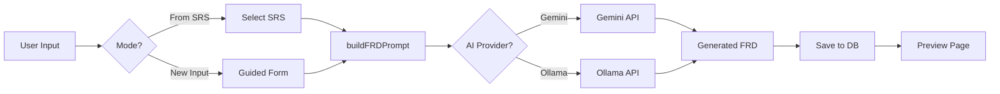

# FRD Generator Implementation Plan

> **Document Type**: Functional Requirements Document (FRD)
> **Standards**: IEEE 29148 / IIBA BABOK v3
> **UI/UX**: Pro Max Design System
> **Created**: 2026-01-23

---

## 📋 Executive Summary

Implement **FRD Generator** following the successful patterns of BRD and SRS generators. The FRD will focus on **functional specifications**, **system interfaces**, and **detailed feature requirements**.

**Key Workflow:**
```
SRS (Use Cases) → FRD (Functional Requirements)
      OR
New Input → FRD (Guided Form - 7 Tabs)
```

---

## 🎯 Goals

1. **Dual Input Modes**:
   - Generate FRD from existing SRS (primary flow)
   - Create FRD from scratch (guided form)

2. **IEEE/IIBA Compliance**:
   - Follow IEEE 29148 (System/Software Requirements)
   - Support IIBA BABOK v3 (Business Analysis standards)

3. **Pro Max UI/UX**:
   - Independent scrolling (sidebar + main content)
   - Consistent design with BRD/SRS pages
   - Mobile responsive

4. **AI-Powered**:
   - Gemini Free (cloud, fast)
   - Ollama (local, private)

---

## 📐 Architecture Decisions

### Routing Structure

```
/frd                    → Mode Selection Page
├── /frd/from-srs      → SRS Selector (transform SRS to FRD)
└── /frd/new           → FRD Form (7-tab guided input)
```

### Data Flow



---

## 🗂️ FRD Form Structure (7 Tabs)

Based on IEEE 29148 and IIBA BABOK v3:

| Tab # | Section | Fields | Priority |
|-------|---------|--------|----------|
| 1 | **Overview** | Project Name, Version, Date, Purpose, Scope, Stakeholders | Critical |
| 2 | **Functional Requirements** | FR ID, Name, Category, Description, Priority, Source (SRS/BRD) | Critical |
| 3 | **System Features** | Feature ID, Name, Description, User Stories, Acceptance Criteria | Critical |
| 4 | **User Interface** | Screen ID, Name, Layout, Flow, Wireframe (optional upload) | High |
| 5 | **Data Requirements** | Entity, Attributes, Relationships, Validation Rules | High |
| 6 | **Integration Points** | System, API, Protocol, Data Format, Authentication | Medium |
| 7 | **Constraints & Assumptions** | Technical Constraints, Business Rules, Assumptions, Dependencies | Medium |

---

## 📦 Phase 1: Foundation (Week 1)

### 1.1 Data Types & Utilities

**File**: `lib/frd-form-utils.ts`

```typescript
export interface FRDFormData {
  overview: {
    projectName: string;
    version: string;
    date: string;
    purpose: string;
    scope: string;
    stakeholders: string[];
  };
  functionalRequirements: FunctionalRequirement[];
  systemFeatures: SystemFeature[];
  userInterface: UIScreen[];
  dataRequirements: DataEntity[];
  integrationPoints: Integration[];
  constraints: {
    technical: string[];
    businessRules: string[];
    assumptions: string[];
    dependencies: string[];
  };
}

export interface FunctionalRequirement {
  id: string; // FR-001
  name: string;
  category: 'Core' | 'Secondary' | 'Nice-to-Have';
  description: string;
  priority: 'High' | 'Medium' | 'Low';
  source: string; // UC-001 (from SRS)
  acceptanceCriteria: string[];
}

export interface SystemFeature {
  id: string; // FT-001
  name: string;
  description: string;
  userStories: string[];
  acceptanceCriteria: string[];
  relatedFR: string[]; // FR-001, FR-002
}

export interface UIScreen {
  id: string; // UI-001
  name: string;
  layout: string;
  flowDescription: string;
  wireframeUrl?: string;
}

export interface DataEntity {
  name: string;
  attributes: { name: string; type: string; required: boolean }[];
  relationships: string[];
  validationRules: string[];
}

export interface Integration {
  systemName: string;
  apiEndpoint: string;
  protocol: 'REST' | 'GraphQL' | 'SOAP' | 'gRPC';
  dataFormat: 'JSON' | 'XML' | 'Protobuf';
  authentication: string;
}
```

**Validation Functions**:
- `validateFRDForm(data: FRDFormData): ValidationErrors`
- `formatStructuredData(data: FRDFormData): string`
- `getInitialFormData(): FRDFormData`

---

### 1.2 AI Prompts

**File**: `lib/ai/prompts/frd-generator.ts`

```typescript
export function buildFRDPrompt(
  content: string,
  options: {
    inputType: 'from-srs' | 'quick' | 'guided';
    template: 'IEEE' | 'IIBA';
    language: 'en' | 'vi';
  }
): string;

export function buildDirectFRDPrompt(
  data: FRDFormData,
  template: 'IEEE' | 'IIBA',
  language: 'en' | 'vi'
): string;
```

**Templates**:
- IEEE 29148 Structure
- IIBA BABOK v3 Structure

---

### 1.3 API Endpoint

**File**: `app/api/generate-frd/route.ts`

```typescript
export async function POST(request: Request) {
  const { inputMethod, data, template, aiProvider, language, srsId } = await request.json();

  let prompt: string;

  if (inputMethod === 'from-srs') {
    // Fetch SRS from database
    const srs = await prisma.document.findUnique({ where: { id: srsId } });
    prompt = buildFRDPrompt(srs.content, { inputType: 'from-srs', template, language });
  } else if (inputMethod === 'form') {
    // Guided mode
    prompt = buildDirectFRDPrompt(data, template, language);
  } else {
    // Quick mode
    prompt = buildFRDPrompt(data, { inputType: 'quick', template, language });
  }

  // Generate using AI
  const result = await generateDocument({
    type: 'FRD',
    input: prompt,
    template,
    provider: aiProvider,
    language,
  });

  // Save to database
  const document = await prisma.document.create({
    data: {
      title: result.title || 'Untitled FRD',
      type: 'FRD',
      content: result.content,
      template,
      language,
      inputMethod,
      sourceDocumentId: srsId || null,
    }
  });

  return NextResponse.json({ success: true, document });
}
```

---

## 🎨 Phase 2: UI Components (Week 2)

### 2.1 Mode Selection Page

**File**: `app/frd/page.tsx`

**Layout**:
```
┌─────────────────────────────────────┐
│         Create FRD Document         │
├─────────────────────────────────────┤
│                                     │
│  ┌───────────────┐ ┌──────────────┐│
│  │  From SRS     │ │  New Input   ││
│  │  Transform    │ │  Guided Form ││
│  └───────────────┘ └──────────────┘│
│                                     │
└─────────────────────────────────────┘
```

**Features**:
- Two card options (From SRS, New Input)
- Glassmorphic design
- Smooth hover animations

---

### 2.2 SRS Selector Page

**File**: `app/frd/from-srs/page.tsx`

**Features**:
- List all SRS documents (table view)
- Search by project name
- Filter by template (IEEE/IIBA)
- "Transform to FRD" button
- Preview SRS content (modal)

---

### 2.3 FRD Form Main Page

**File**: `app/frd/new/page.tsx`

**Layout** (identical to SRS):
```
┌────────────────────────────────────────────┐
│  Header: Create New FRD                    │
├──────────┬─────────────────────────────────┤
│ Sidebar  │  Main Content (7 Tabs)          │
│ Settings │  ┌────────────────────────────┐ │
│          │  │ 1. Overview                │ │
│ - AI     │  │ 2. Functional Requirements │ │
│ - Std    │  │ 3. System Features         │ │
│ - Lang   │  │ 4. User Interface          │ │
│ - Mode   │  │ 5. Data Requirements       │ │
│ - %      │  │ 6. Integration Points      │ │
│          │  │ 7. Constraints             │ │
│ (scroll) │  └────────────────────────────┘ │
│          │                    (scroll)     │
└──────────┴─────────────────────────────────┘
```

**Sidebar Components** (reuse from SRS):
- AI Provider selector
- Document Standard (IEEE/IIBA)
- Language (EN/VI)
- Input Mode (Quick/Guided)
- Form Completion Progress

---

### 2.4 Form Sections (Components)

**Directory**: `components/frd-form/`

| Component | File | Description |
|-----------|------|-------------|
| Overview | `OverviewSection.tsx` | Project info, purpose, scope |
| FR List | `FunctionalRequirementsSection.tsx` | FR editor with auto-ID |
| Features | `SystemFeaturesSection.tsx` | Feature cards with user stories |
| UI Screens | `UserInterfaceSection.tsx` | Screen list with wireframe upload |
| Data | `DataRequirementsSection.tsx` | Entity editor with attributes |
| Integration | `IntegrationPointsSection.tsx` | API specs table |
| Constraints | `ConstraintsSection.tsx` | Lists for tech/business/assumptions |

---

## 🔧 Phase 3: Integration (Week 3)

### 3.1 Database Schema Update

**File**: `prisma/schema.prisma`

```prisma
enum DocumentType {
  BRD
  SRS
  FRD
}

model Document {
  id                String   @id @default(cuid())
  type              DocumentType
  sourceDocumentId  String?  // Link to parent (BRD→SRS or SRS→FRD)
  sourceDocument    Document? @relation("DocumentHierarchy", fields: [sourceDocumentId], references: [id])
  childDocuments    Document[] @relation("DocumentHierarchy")
  // ... existing fields
}
```

**Migration**: `npx prisma migrate dev --name add-frd-type`

---

### 3.2 Header Navigation Update

**File**: `components/Header.tsx`

Add third navigation item:
```tsx
<Link href="/frd" className="...">
  Create FRD
</Link>
```

---

### 3.3 Home Page Update

**File**: `app/page.tsx`

Add FRD card:
```tsx
<FeatureCard
  title="FRD Generator"
  description="Functional Requirements Document"
  icon={<CubeIcon />}
  href="/frd"
  gradient="from-orange-600 to-amber-600"
/>
```

---

## ✅ Phase 4: Testing & Verification

### 4.1 Functional Tests

| Test Case | Expected Result | Status |
|-----------|-----------------|--------|
| Mode selection loads | 2 cards visible | |
| From-SRS page loads | SRS list displayed | |
| New Input form loads | 7 tabs rendered | |
| Tab navigation works | Smooth transitions | |
| Form validation works | Errors highlighted | |
| AI generation (Gemini) | FRD created in 30-60s | |
| AI generation (Ollama) | FRD created locally | |
| SRS → FRD conversion | Use Cases → FRs mapped | |
| Database persistence | FRD saved correctly | |
| Preview page loads | Markdown rendered | |

---

### 4.2 UI/UX Verification

| Criteria | Requirement | Status |
|----------|-------------|--------|
| **Independent Scrolling** | Sidebar + Main scroll separately | |
| **Pro Max Design** | Glassmorphism, gradients, animations | |
| **Mobile Responsive** | Works on 320px+ screens | |
| **Accessibility** | Keyboard nav, ARIA labels | |
| **Dark Mode** | Consistent with BRD/SRS | |
| **Form Progress** | Real-time % calculation | |
| **Loading States** | Spinner during AI generation | |
| **Error Handling** | User-friendly error messages | |

---

## 📊 Completion Metrics

### Deliverables Checklist

- [ ] `lib/frd-form-utils.ts` (types, validation)
- [ ] `lib/ai/prompts/frd-generator.ts` (prompts)
- [ ] `app/api/generate-frd/route.ts` (API)
- [ ] `app/frd/page.tsx` (mode selection)
- [ ] `app/frd/from-srs/page.tsx` (SRS selector)
- [ ] `app/frd/new/page.tsx` (main form)
- [ ] `components/frd-form/*.tsx` (7 sections)
- [ ] `components/Header.tsx` (updated nav)
- [ ] `app/page.tsx` (FRD card added)
- [ ] Database migration (FRD type)
- [ ] TypeScript compilation (0 errors)
- [ ] Manual testing (all test cases pass)

---

## 🚀 Future Enhancements (Phase 5)

### A. Traceability Matrix
- Visual diagram: BRD → SRS → FRD
- Coverage report: "80% of Use Cases have FRs"

### B. Version Comparison
- Diff view for FRD versions
- Change log with timestamps

### C. Approval Workflow
- Reviewer assignment
- Comments per requirement
- Status tracking (Draft/Review/Approved/Rejected)

### D. Export Templates
- Jira User Stories (CSV)
- Azure DevOps Work Items (JSON)
- GitHub Issues (Markdown)

### E. AI Enhancements
- Auto-generate acceptance criteria
- Suggest test cases per FR
- Validate completeness (missing fields)

---

## 📝 Notes

1. **Reuse Pattern**: FRD follows exact structure of SRS for consistency
2. **7 Tabs**: More than SRS (5 tabs) due to functional depth
3. **From-SRS Priority**: Primary flow is SRS → FRD (technical progression)
4. **Form Complexity**: FRD form is most complex (detailed specifications)
5. **AI Challenge**: Must handle structured data (entities, APIs, screens)

---

## 🎯 Success Criteria

- [ ] User can generate FRD from existing SRS in < 2 minutes
- [ ] User can create FRD from scratch via guided form
- [ ] FRD conforms to IEEE 29148 / IIBA BABOK v3
- [ ] UI matches "Pro Max" design standards
- [ ] TypeScript compilation: 0 errors
- [ ] All test cases pass
- [ ] Mobile responsive (320px+)
- [ ] Independent scrolling works

---

**Next Step**: Review this plan, then run `/enhance` to begin implementation! 🚀
